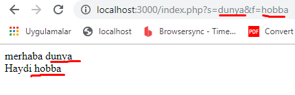
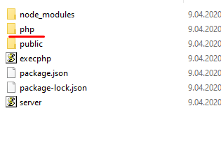
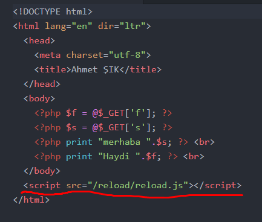

# refreshPhp
localde yazdığını php dosyalarını otomatik olarak tarayıcıda gösterir. Bu amaç doğrultusunda bir kaç tane nodejs paketinin bir araya getirilmesiyle oluşturuldu.

## Kurulum ve kullanım aşamaları
* Nodejs uygulamasının bilgisayarınızda kurulu olması gerekir. Eğer bilgisayarınızda kurulu değilse https://nodejs.org/en/ linke tıklayarak kurulum yapabilirsiniz.

* Dosyayı indirin ve localhostunuzda herhangi bir dizine yapıştırın. dosya isminizin ne olduğu önemli değil her hangi bir isimde olabilir.

* nodejs terminalini açarak dosyaları kopyaladığınız dizine gelin.

Aşağıdaki komutları sırasıyla nodejs terminaline yazınız.
> npm install

Yukarıdaki komut gerekli modullerin kurulmasını sağlayacaktır.

Kurulum bittikten sonra
> npm start

komutunu yazmanız durumunda nodejs tarafından  http://localhost:3000/ şeklinde bir servis oluşturulacak.

Kopyalama bittikten sonra tarayıcınıza aşağıdaki linki yazın.

> http://localhost:3000/index.php?s=dunya&f=hobba

Bu aşamadan sonra css, js, html ve php dosyalarınızda her hangi bir değişiklik yapmanız durumunda tarayıcıdan otomatik olarak gözlemleyebilirsiniz.

getlerin çalıştığına dikkat ediniz..

Yeni ekleyeceğiniz php dosyaları

php dizini altında olmalıdır ve ana dizin ise index.php olmalıdır.  

Bu kısım çok önemli index.php sayfasında aşağıdaki kodun her zaman olması gerekiyor.
> 

